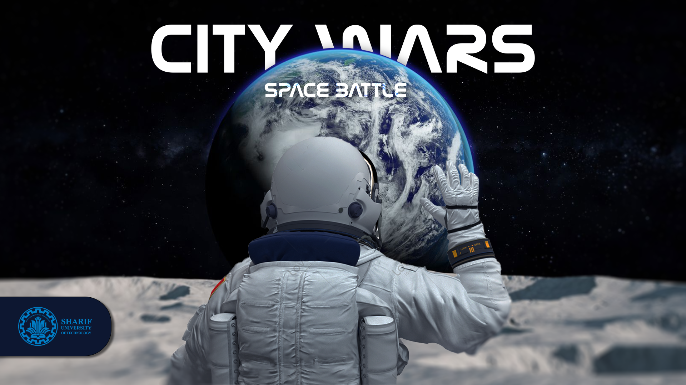
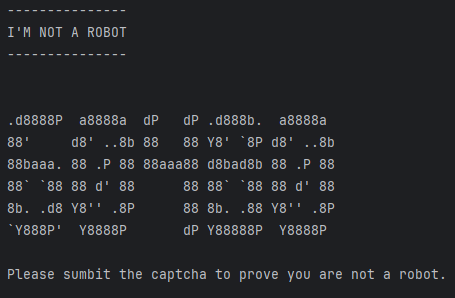
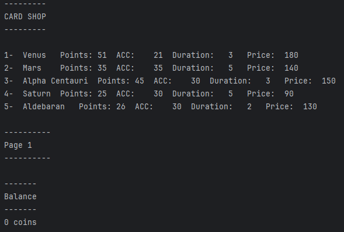
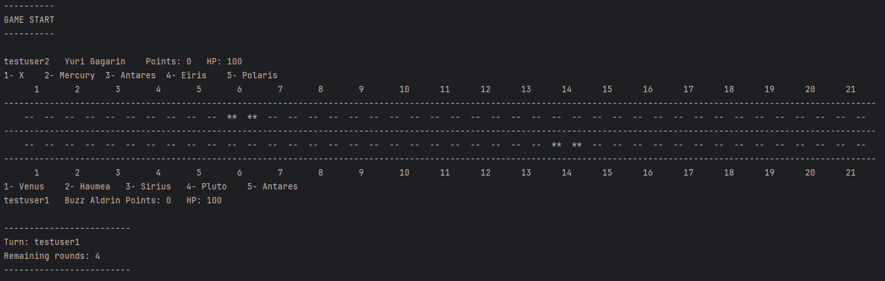
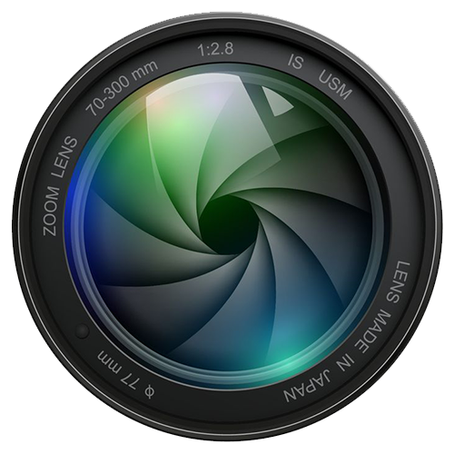
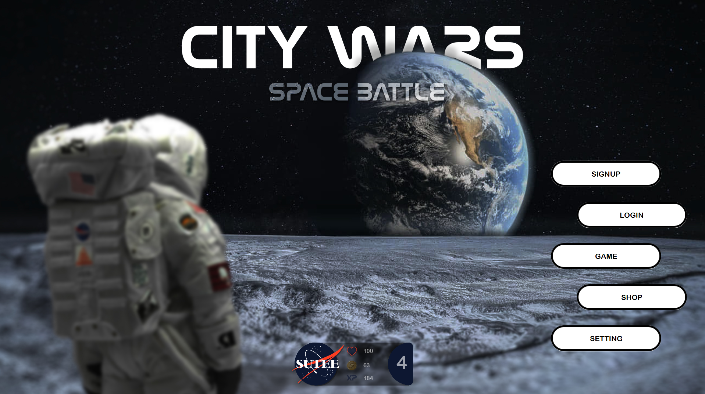
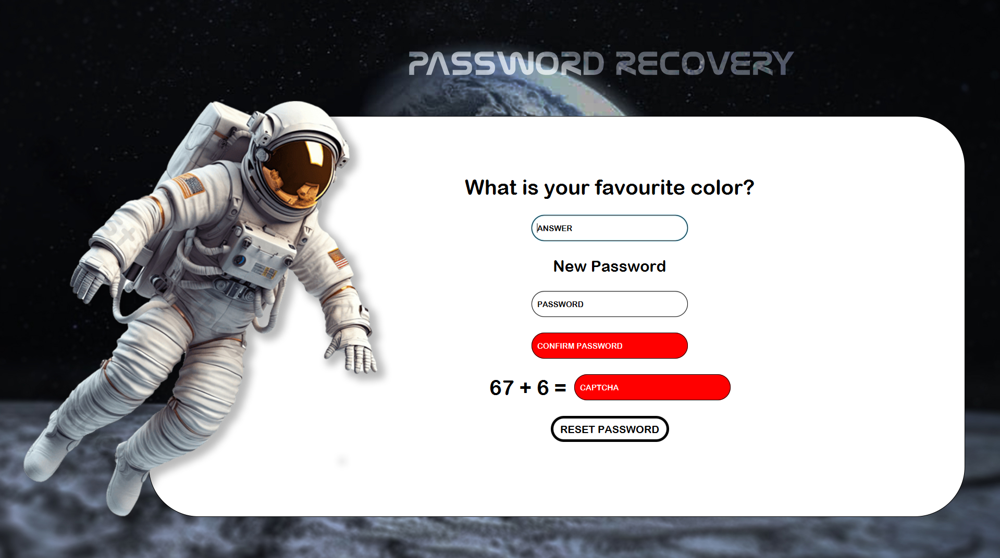
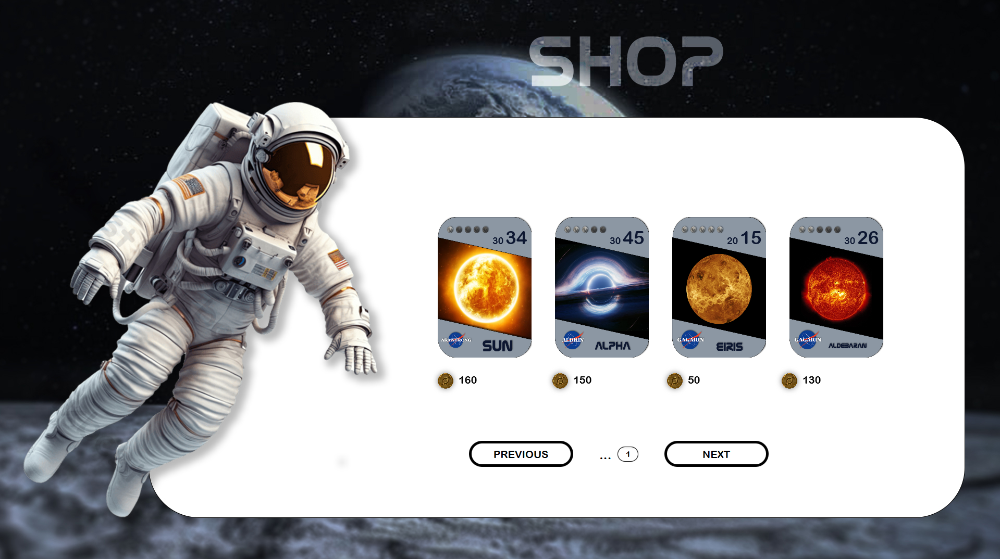
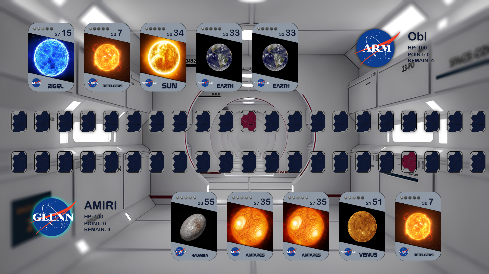
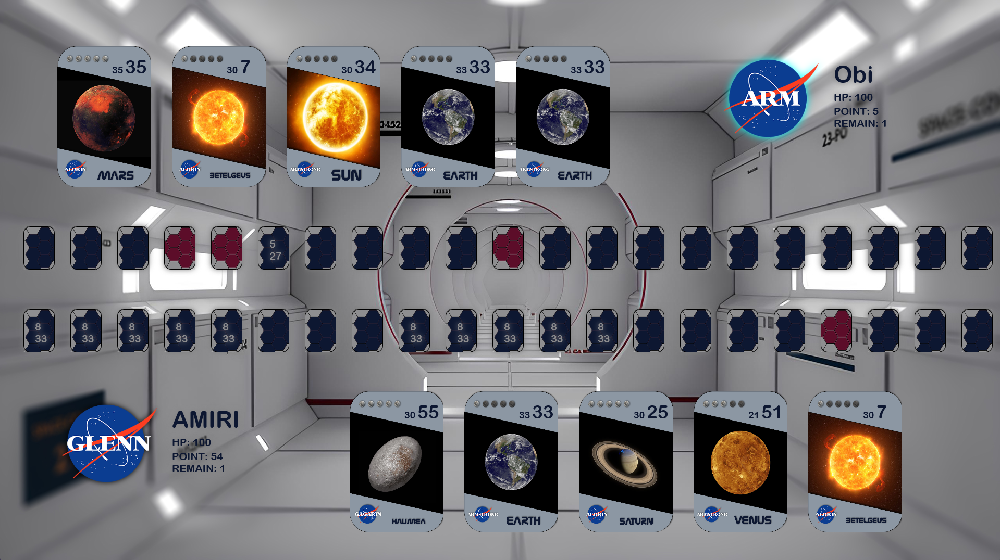

# **2024** OOP Project .: ***City Wars; Space Battle*** :.

>  ***Electrical Engineering Department, Sharif University of Technology*** 

<h2 align = "left">
 TABLE OF CONTENTS</h2>

- [GAME PREVIEW](#game-preview)
- [PROJECT DESCRIPTION](#project-description)
  - [PHASE 1](#phase1)
  - [PHASE 2](#phase2)
- [PROJECT MANAGEMENT](#management)
- [GAME DESIGN](#design)
  - [UML DESIGN DIAGRAM](#uml)
- [CREDITS](#credits)
- [GAME SNAPSHOTS](#snapshots)

<a href = "#game-preview">
<h2 align = "center">GAME PREVIEW</h2>
</a>

  

<a href = "#project-description">
<h2> <b>  Project Description </b> </h2>
</a>

***City Wars; Tokyo Reign*** is a CCG Turn-Based Game designed and developed by an independant game development company called ***Mojo Bones Ltd*** located in the U.K which has been published in August 2022.

In this project, we are trying to make our own version of the game using the power of **Object Oriented Programming** and ***Java*** as one of the most frequently used Object Oriented Programming languages.

As for the graphics, we will use ***JavaFX*** as a software platform designed to deliver desktop applications.

The UML Design Diagram of the Classes, Methods and Attributes used are also available at the end of this document.

<a href = "#phase1">
<h3 align="center">Phase 1</h3>
</a>

Implementing the main game logic, handling data (users and games data) using **SQLite3** and designing a **CLI** (Command Line Interface) for the game.

 <i> Early stages of game developement (Game Logic Design) </i>

<a href = "#phase2">
<h3 align="center">Phase 2</h3>
</a>

Implementing the **GUI** (Graphical User Interface) for the game. You can explore the [game snapshots](#snapshots) as well.
<a href = "#management">
<h2>   <b> Project Management </b> </h2>
</a>

In this project we are using ***Trello*** for task management.

  [***Trello Board Link***](https://trello.com/invite/b/UbugGn2a/ATTI5b553fdbf8647934e1ab1f9953646ba563370E56/oop-2024-project)

<a href = "#design">
<h2>  <b> Game Design </b> </h2>
</a>

Here is the UML Design Diagram of the classes and methods used in the design of this game.

[***UML Design Diagram (High Quality)***](https://github.com/AmirMJ-Z/OOP-2024-Project/blob/main/UML%20Diagram.jpeg?raw=true)

<a href = "#credits">
<h2>  <b> Credits </b> </h2>
</a>

Students involved in the develpment of the project

| Student Name | School | Student ID |
| --- | --- | --- |
| *Amirreza Mirjalily* | EE Department, SUT | 402102549 |
| *Mobin Behravan* | EE Department, SUT | 402101385 |

<a href = "#project-description">
<h2>  Game Snapshots </h2>
</a>

